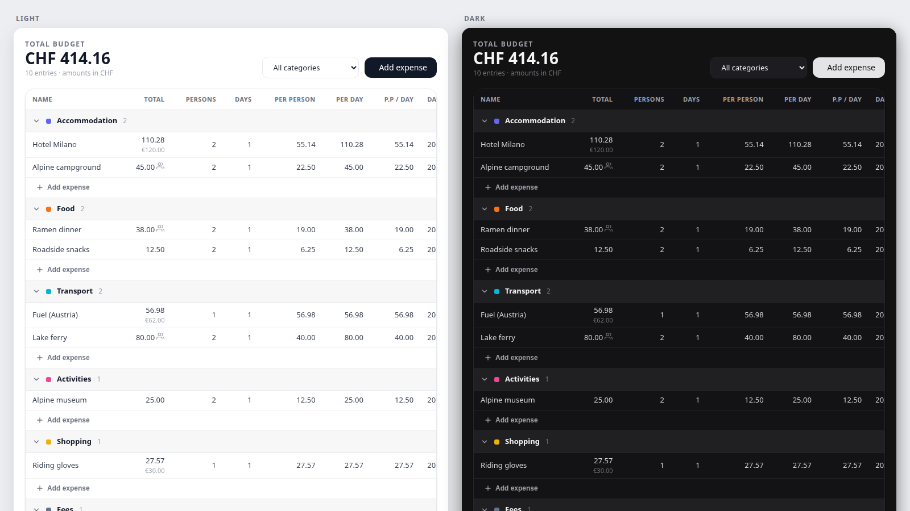

# budget-table

Bring back the pre-v3.1 **categorized budget table** as a per-trip tab in TREK.

## What it does

TREK's budget rework (around v3.1) replaced the old categorized spreadsheet with
a daily-expense and settlement flow. This plugin brings the table back as its own
tab inside every trip planner — a fast, editable overview built directly on your
existing budget items (nothing is duplicated or forked).

- **Category-grouped table.** Every expense is grouped under its category
  (Accommodation, Food, Groceries, Transport, Flights, Activities, Sightseeing,
  Shopping, Fees, Health, Tips, Other), with a collapsible header, a per-category
  subtotal, and a running trip total.
- **The classic columns.** Name, Total, Persons, Days, and the computed
  **Per person**, **Per day**, and **Per person / day** figures — the exact
  planning math the old table gave you, back again.
- **Inline editing.** Click any cell to edit it in place; Enter or Tab saves,
  Escape cancels. Add a row to any category with one click; its date pre-fills
  from the previous entry so back-filling old expenses is quick.
- **Four summaries.** Switch between **By category**, **By date**, **By payer**,
  and **Paid vs unpaid** breakdowns — handy for reporting totals to sponsors or
  splitting who paid what.
- **Shown in your currency.** Every amount is converted into your personal display
  currency (Settings → default currency) using live exchange rates, exactly like
  TREK's native Costs panel — so if your account is set to CHF, the table and all
  totals read in CHF even when the trip's base currency is something else.

Splits and settle-up stay in TREK's native Budget tab; this plugin is the
planning and overview surface, so amounts tied to an assigned payer are shown
read-only here to keep settlement balanced.

## Screenshots

The store card image lives at `docs/screenshot.png` (shown above): the table
rendered in both light and dark themes with a sample motorcycle-trip budget,
demonstrating category grouping, currency conversion, and the per-person columns.

## Permissions

| Permission | Why |
|---|---|
| `db:read:trips` | Read the trip to get its **base currency**, so every amount and total is shown and converted in the right currency. |
| `db:read:costs` | Read the trip's **budget items** (expenses) to build the table and the category / date / payer / paid summaries. |
| `db:write:costs` | Create, edit, and delete **expenses** from the table — inline cell edits, the per-category "Add expense" action, and row deletion. Writes require your own `budget_edit` permission on the trip. |
| `http:outbound:api.frankfurter.dev` | Fetch **live exchange rates** from `api.frankfurter.dev` (keyless, the same service TREK core uses) to convert every amount into your display currency. No other host is contacted. |

## Setup

1. In TREK, open **Admin → Plugins**, install **Budget Table**, and activate it
   (approve the permissions above, including the outbound rate lookup to
   `api.frankfurter.dev`).
2. The trip's **Budget** (Costs) add-on must be enabled — the plugin reads and
   writes budget items and will report that the add-on is disabled otherwise.
3. Open any trip: a **Budget Table** tab appears in the trip planner. That's it —
   there is nothing else to configure.

For local development: `npm run dev` serves the plugin at
`http://localhost:4317` (no TREK instance needed) and `npm test` runs the server
route tests.

## License

MIT — this plugin is your own code; use it however you like.
